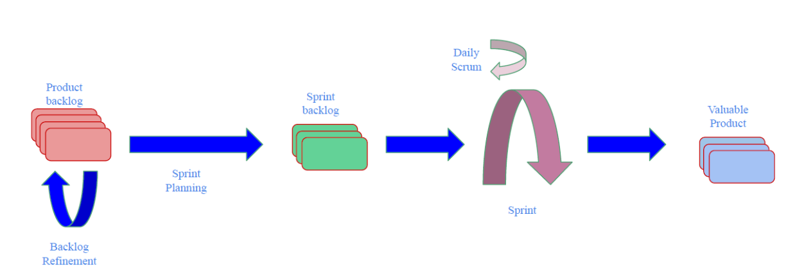

# Telekomunikacijski softver inženjering  - Implementacija Fourierove transformacije

## Opis projekta

Studenti će prvo implementirati diskretnu Fourierovu transformaciju (DFT)
ručno, a zatim optimiziranu verziju, brzu Fourierovu transformaciju (FFT).
Nakon toga će koristiti postojeće Python biblioteke (kao što je NumPy) za
validaciju svojih rješenja i poređenje performansi. Pored implementacije, studenti će koristiti softverski inženjering kako bi osigurali ispravnost i efikasnost
svog koda. U nastavku su objašnjene faze prilikom rada na projektu.

**Ručno implementiranje DFT algoritma:**
U ovoj fazi potrebno je razviti osnovni algoritam za diskretnu Fourierovu transformaciju (DFT) bez oslanjanja na gotove biblioteke. Fokus aktivnosti je razumijevanje osnovnih operacija koje   čine algoritam, kao i matematičke osnove potrebne za njegovu realizaciju.

**Implementacija FFT algoritma:**
Nakon uspješne implementacije DFT-a, potrebno je optimizovati rješenje primjenom brze Fourierove transformacije (FFT). Cilj ove faze je analizirati i primijeniti principe optimizacije koji čine FFT efikasnijim u poređenju sa osnovnim DFT algoritmom.

**Validacija rješenja i poređenje performansi:**
U završnoj fazi koristiće se postojeće Python biblioteke, poput NumPy-a, za validaciju tačnosti implementiranih rješenja. Dodatno, neophodno je izvršiti poređenje performansi ručne   implementacije sa gotovim bibliotečkim rješenjima, fokusirajući se na vrijeme izvršenja i efikasnost svakog pristupa.

---
## Specifikacija ciljeva projekta

•Razumjeti teorijske osnove Fourierove transformacije.

• Naučiti kako implementirati DFT i FFT algoritme.

• Primijeniti principe softverskog inženjeringa kao što su modularni dizajn,
  testiranje i verziona kontrola.
  
• Rad sa bibliotekama za numeričke operacije u Pythonu (npr. NumPy).

• Optimizirati algoritme za bolje performanse.

• Analizirati signale koristeći implementirane Fourierove transformacije

---
## Konceptualna scrum šema po kojoj je vođen projekat

-  Scrum šema predstavlja okvir za iterativni i inkrementalni razvoj projekata, gdje tim kroz organizovane sprintove radi na postizanju jasno definisanih ciljeva. Ključni elementi uključuju backlog za upravljanje zadacima, ceremonije 
  poput dnevnih sastanaka i retrospektiva za koordinaciju i poboljšanje, te kontinuiranu isporuku funkcionalnih inkremenata proizvoda. Konceptualna shema sistema je prikazana na slici 1:

 
Slika 1: Konceptualna scrum shema 

---

## Koraci za implementaciju projektnog zadatka u spiralama:

- **Sprint 1 - Razumijevanje osnova FT:**
  - Planiranje projekta uključuje definisanje vremenskog okvira za svaku fazu, od implementacije DFT algoritma do validacije i analize performansi, kako bi se osiguralo pravovremeno izvršenje zadataka. Takođe, potrebno je odrediti uloge i odgovornosti članova tima, kao i obezbijediti resurse poput softverskih alata i literature za uspješnu realizaciju projekta.

- **Sprint 2 - Implementacija DFT - a:**
  - Sprint "Implementacija DFT" fokusiran je na razvoj osnovnog algoritma za diskretnu Fourierovu transformaciju, bez korišćenja eksternih biblioteka. Cilj sprinta je postizanje funkcionalne implementacije koja precizno izvršava transformaciju i omogućava dalju optimizaciju kroz FFT.

- **Sprint 3 - Implementacija FFT - a:**
  - U ovom sprintu fokus je na optimizaciji prethodno razvijenog DFT algoritma kroz implementaciju brze Fourierove transformacije (FFT). Cilj je postići značajno poboljšanje performansi uz zadržavanje tačnosti rezultata.

- **Sprint 4 - Unapređenje koda:**
  - Ovaj sprint bio je posvećen unapređenju performansi implementiranih algoritama, sa posebnim fokusom na optimizaciju FFT-a i njegovo poređenje sa osnovnom DFT implementacijom. Takođe, proširena je funkcionalnost sistema, uz dodatne aktivnosti testiranja i dopunjavanja dokumentacije.

- **Sprint 5 - Finalizacija projekta:**
  - Fokus ovog sprinta bio je na završnim korekcijama i optimizaciji implementiranih funkcionalnosti, uz detaljne provjere sistema i ispravke preostalih grešaka. Cilj je bio osigurati potpunu funkcionalnost i kvalitet projekta, uz finalizaciju dokumentacije za prezentaciju i isporuku.

---
## Rezultati
 Prikaz rezultata u vremenskom i frekvencijskom domenu omogućava vizualizaciju stvarnog (realnog) i kompleksnog dijela signala, kao i analizu magnitude i faze. Rezultati pokazuju kako signali prelaze iz vremenskog u frekvencijski domen, uz jasne razlike između različitih implementacija i oblika signala.

**Slika 2:**
 - Na ovoj slici prikazan je kompleksniji signal u vremenskom i frekvencijskom domenu. Realni dio signala u vremenskom domenu (gornji lijevi grafikon) pokazuje varijacije amplitude kroz uzorke, dok je kompleksni dio (donji lijevi grafikon) približno nula. U frekvencijskom domenu (gornji srednji i donji srednji grafikon) vidljive su izražene komponente na određenim frekvencijama, dok magnitude i faze (desni grafikoni) ukazuju na raspodjelu energije signala i njegovu faznu promjenu.

 
Slika 1: Konceptualna scrum shema 

